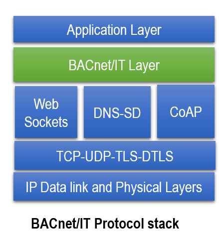
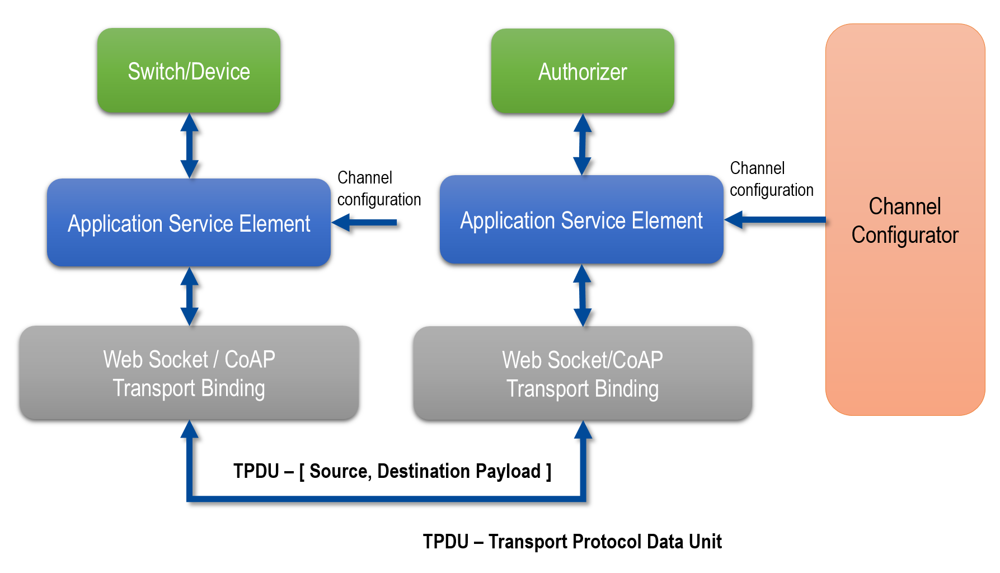
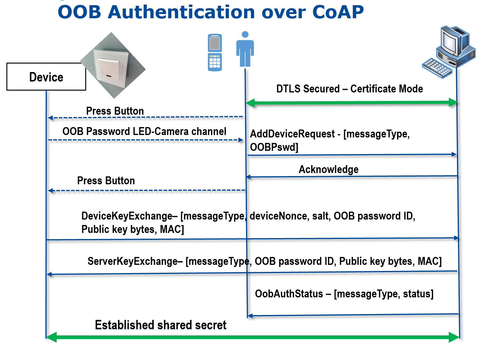

### Secure CoAP transport port binding to BACnet/IT 

This project is a clone of https://github.com/fhnw-bacnet-it. 
This project is created to provide concept and implementation of secure CoAP transport binding to BACnet/IT protocol stack and security is considered in design and an out-of-band authentication protocol is defined.

###Implementation Stack of this repo

   </img> </img>

The BACnetMobileAuthenticator implementation is avaliable [here](https://github.com/vikram919/BACnetITMobileAuthenticator).